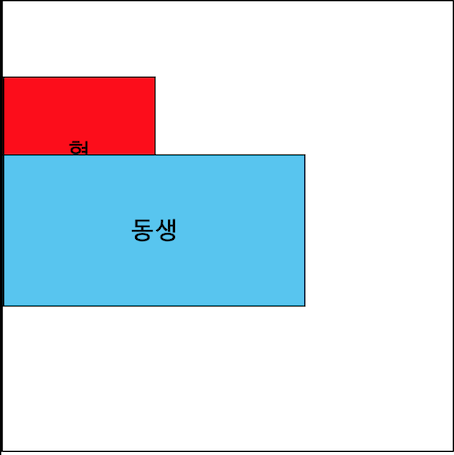

# CSS - Position
> 특정 규칙들(`static`, `relative`, `absolute`,`fixed`)을 기준으로 `left`, `right`, `top`, `bottom`을 설정하여 위치를 이동 할 수 있는 속성

## static

* 가장 기본이 되는 포지션 속성
* 아무 속성도 지정하지 않는경우 static의 속성을 갖는다.

## relative

* 원래의 static 자리 기준으로 이동하며, 기존의 자리를 비워두지않고 채워둔다. 
    
    * 다음 객체는 현재 객체가 있다고 인식함.
    
      
    
    * 위와같이 형이 relative속성을 갖고 이동을 했음에도 불구하고, 동생은 형의 자리를 비워 두었다.
* 약간의 위치 이동이 필요할때 사용

## absolute

* 부모 객체를 기준으로 자리를 이동하는 속성
* 직계 부모가 staic인경우, static이 아닌 조상을 찾을때 까지 기준점을 찾기 위해 한단계씩 이동하며, body로 올라갈때까지 static이 아닌 조상을 찾지 못한다면 body를 기준으로 위치가 생성된다.
    
    * static 이 아닌경우 : `relative`, `absolute`, `fixed`
    
      
    
    * 위 그림에 따르면 가장 내부의 absolute 객체는 두개의 static 부모를 거쳐 relative 속성을 가진 빨간색 객체까지 기준점을 찾아 올라간다.
    
* 위치를 이동하면서 본래의 공간을 비운다.
    
    * 다음 객체는 현재의 객체가 없다고 인식하여, 빈자리를 다음 객체들이 차곡차곡 채운다.
    
      
    
    * 위 그림은 형이 absolute 속성을 갖고 이동함에 따라 원래 형의 자리가 비어있음으로 인식하고 동생이 형의 원래 자리를 차지하였다.
* 팝업, 제어센터, 등의 기능을 할 때 사용

## fixed

* 지정된 위치에 계속 고정되어있는 위치 속성이다. 
* 스크롤바가 이동하더라도 fixed속성을 가진 객체는 지정된 위치에 고정되어있다.

---

## z-index

> 각 객체들의 z축 위치
* position 속성이 **static이 아닌 경우**에만 적용된다.
* 수가 작을수록 뒤, 클수록 앞

