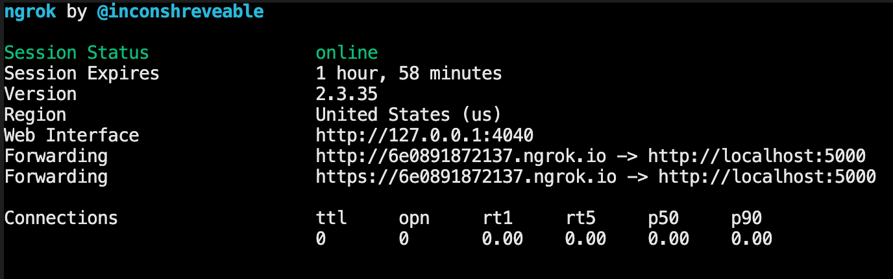

# ngrok

> Local 호스트를 외부에서 접속 할 수 있도록 하는 터널 프로그램

#### 설치

* `brew install ngrok`
* Mac OS 환경에서 `homebrew` 가 설치되어있을 때 사용 가능한 명령어

#### 실행

* `ngrok <protocol> <port>`
  * `ngrok http 5000` 
* 

#### 특징

* `http` `https` 로 발급된 주소를 통해 **어디서든지** `localhost`에 접속 할 수있다.
* **무료버전** 사용시, 한번 실행 했을때의 세션타임은 **2시간**
* 2시간이 지나면 자동으로 세션이 만료되며, 계속 사용하기 위해서는 재실행 해야한다.
* 재실행하면 발급 주소가 변경된다.

